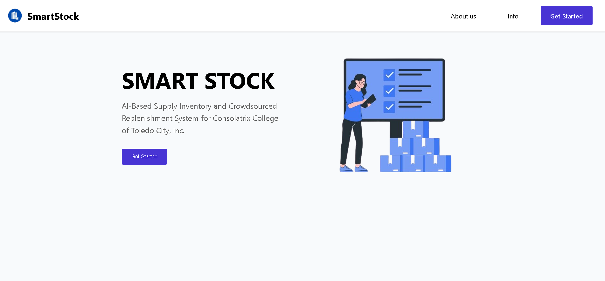

# **SmartStock: AI-Based Supply Inventory and Crowdsourced Replenishment System**  

## 📌 **Project Overview**  
SmartStock is a web-based inventory management system designed for **Consolatrix College of Toledo City, Inc.** It allows **students, teachers, and staff** to vote on needed supplies, while **admins** manage inventory. The system includes AI features for supply prediction, fraud detection, and chatbot support.

## 🚀 **Features**  
- 📊 **AI-Powered Supply Prediction** – Forecasts needed inventory.  
- 🔍 **Anomaly Detection** – Helps prevent fraudulent transactions.  
- 💬 **AI Chatbot** – Provides support for users.  
- 🏫 **Voting System** – Students and staff can request and prioritize supplies.  
- 📦 **Inventory Management** – Admins track stock levels efficiently.  

## 🛠 **Tech Stack**  
- **Frontend:** React.js, Vite, Javascript, Lucid  
- **Backend:** Express.js (Working Progress)  
- **Database:** PostgreSQL (Working Progress)
- **AI Tools:** ChatGPT, Machine Learning for predictions  

## 🏗 **Installation & Setup**  
### **1️⃣ Clone the Repository**  
- _[In Terminal]_
- -> git clone https://github.com/MaeAnn-Abellon/SmartStock
- -> cd smartstock

### **2️⃣ Install Dependencies**  
- _[In Terminal]_
- -> npm install

### **3️⃣ Run the Development Server** 
- _[In Terminal]_
- -> npm run dev

**The website will be available on an available localhost.**

### 📦 **Dependencies**  
Before running the project, make sure you have these installed:  

#### **🔹 System Requirements**  
- **Node.js** – [Download here](https://nodejs.org/)  
- **npm** – Comes with Node.js  

#### **🔹 Required Packages**  
These dependencies are automatically installed with `npm install`, but if you run into issues, install them manually:  
- 🔸**npm install vite@latest**
- 🔸**npm install react-router-dom**
- 🔸**npm install @mui/icons-material**
- 🔸**npm install @mui/material @emotion/react @emotion/styled**
- 🔸**npm install lucide-react**

## 🎯 **Usage Guide**  
1. **Sign in** using your credentials.  
2. **Vote for necessary supplies** – Students and staff can request and prioritize supplies.  
3. **Manage inventory** – Admins can track stock levels and approve requests.  
4. **Check AI predictions** – View recommendations for restocking supplies.  
5. **Chat with the AI bot** – Get assistance and support through the chatbot.  

## YouTube Video - Pitching & Demo
**Come take a look at our video pitch and website demonstration 🎥**

